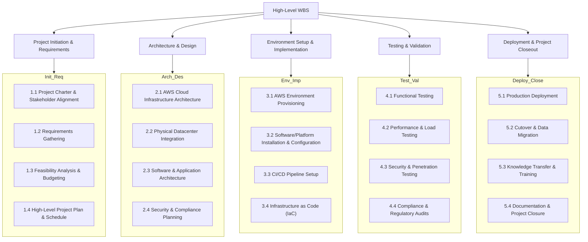

```mermaid
flowchart TB
    A[High-Level WBS] --> A1["Project Initiation & Requirements"]
    A[High-Level WBS] --> A2["Architecture & Design"]
    A[High-Level WBS] --> A3["Environment Setup & Implementation"]
    A[High-Level WBS] --> A4["Testing & Validation"]
    A[High-Level WBS] --> A5["Deployment & Project Closeout"]

    subgraph Init_Req
    A1_1["1.1 Project Charter & Stakeholder Alignment"]
    A1_2["1.2 Requirements Gathering"]
    A1_3["1.3 Feasibility Analysis & Budgeting"]
    A1_4["1.4 High-Level Project Plan & Schedule"]
    end

    subgraph Arch_Des
    A2_1["2.1 AWS Cloud Infrastructure Architecture"]
    A2_2["2.2 Physical Datacenter Integration"]
    A2_3["2.3 Software & Application Architecture"]
    A2_4["2.4 Security & Compliance Planning"]
    end

    subgraph Env_Imp
    A3_1["3.1 AWS Environment Provisioning"]
    A3_2["3.2 Software/Platform Installation & Configuration"]
    A3_3["3.3 CI/CD Pipeline Setup"]
    A3_4["3.4 Infrastructure as Code (IaC)"]
    end

    subgraph Test_Val
    A4_1["4.1 Functional Testing"]
    A4_2["4.2 Performance & Load Testing"]
    A4_3["4.3 Security & Penetration Testing"]
    A4_4["4.4 Compliance & Regulatory Audits"]
    end

    subgraph Deploy_Close
    A5_1["5.1 Production Deployment"]
    A5_2["5.2 Cutover & Data Migration"]
    A5_3["5.3 Knowledge Transfer & Training"]
    A5_4["5.4 Documentation & Project Closure"]
    end

    A1 --> Init_Req
    A2 --> Arch_Des
    A3 --> Env_Imp
    A4 --> Test_Val
    A5 --> Deploy_Close

```
