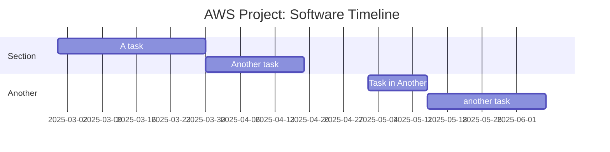

- Gantt code/syntax: https://mermaid.js.org/syntax/gantt.html 
- markdown syntax: https://www.markdownguide.org/cheat-sheet/ 

- assuming we work on the project from 2/28 to 5/2

```mermaid
gantt
    title AWS Project: Software Timeline
    dateFormat YYYY-MM-DD
    section Section
        A task          :a1, 2025-02-28, 30d
        Another task    :after a1, 20d
    section Another
        Task in Another :2025-05-02, 12d
        another task    :24d
```
