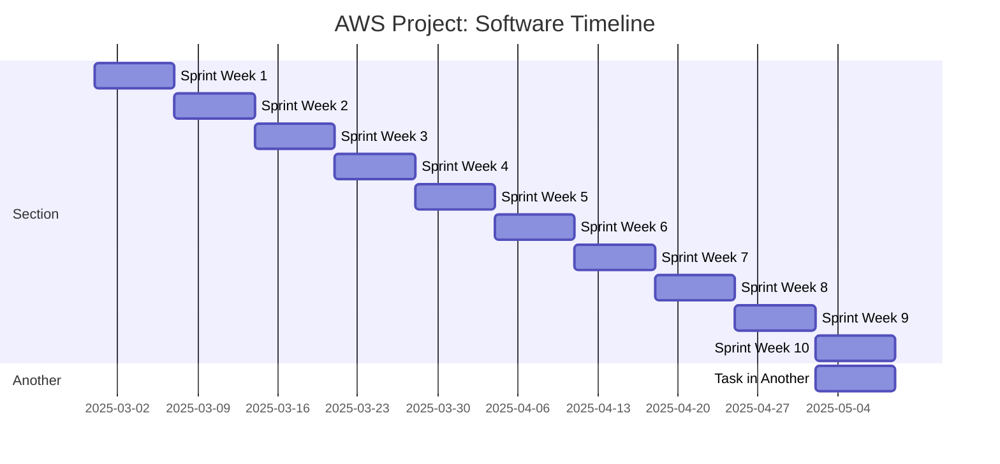

- Gantt code/syntax: https://mermaid.js.org/syntax/gantt.html 
- markdown syntax: https://www.markdownguide.org/cheat-sheet/ 

- assuming we work on the project from 2/28 to 5/2
- should we categorize our sprint weeks into diff sections, ex: phase 1 of project: infrastructure?????
- sprint week doesn't necessarily have to be a week long, we could make some sprint weeks many weeks long?
- also maybe instead of naming sprint week 1, 2, 3, etc, we name it the specific task goal, or combine them ex: "sprint week 1: task"

