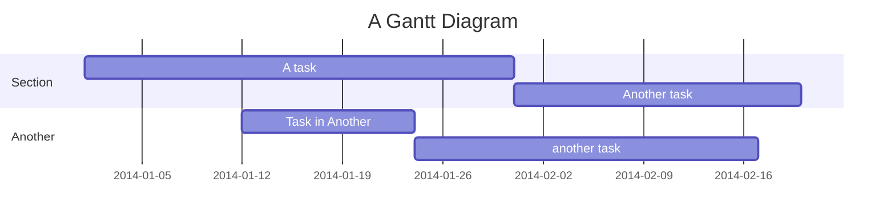

- Gant code/syntax: https://mermaid.js.org/syntax/gantt.html 
- markdown syntax: https://www.markdownguide.org/cheat-sheet/ 
- Also, I'm not familiar with Github, so if I make any mistakes I'm sorry TT

- template, kind of, I just copy and pasted from the gantt website

