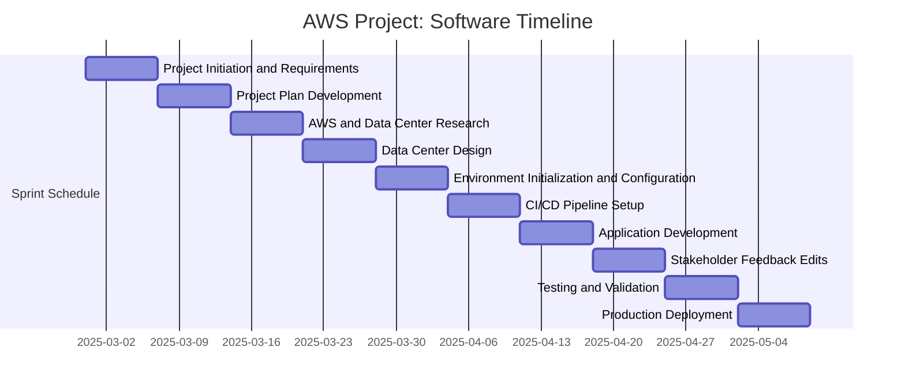

- Gantt code/syntax: https://mermaid.js.org/syntax/gantt.html 
- markdown syntax: https://www.markdownguide.org/cheat-sheet/ 

- Assuming project cycle from 2/28 to 5/2
- More specialized sprints when project specifications recieved

